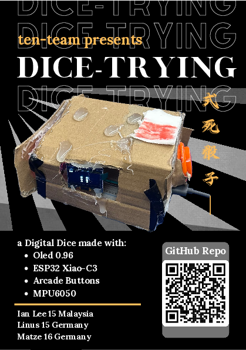
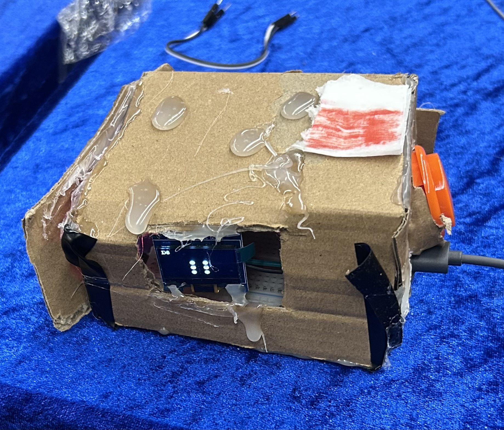

# DiceTrying

## What is this?
Its a dice... But you can choose what kind with the big buttons on the side. From D2 all the way to D20.

## How do I use this?
Shake it and it will roll the dice. Press the side buttons to switch the dice type.

## Why does this exist?
This was made during Fallout 2026 in Shenzhen. Our original project kept failing and when it got close to the deadline we made this instead!

# Features
## Marketing
- BYOP system - Flexable power system, compatible with millions of USB devices
- Nostalgia inducing - sits right at home with arcade style buttons
- Impairment friendly due to big buttons (screen not so much)
- Adheres to most EU product guidelines
- Environmentally friendly Case made out of 80% recycled material and HMA
- CAD case (Cardboard aided design)
- Open air design with good airflow
- User servicable - easy to open and repair

## Real
- Available dices: D2, D4, D6, D8, D12, D20
- Randomness made with the esp32s RNG

# BOM
| Name | Qty |
| -------------- | - |
| Xiao esp32c3   | 1 |
| MPU6050        | 1 |
| Arcade buttons | 2 |

# Wiring
| Module Pin | MCU Pin |
| ---------- | ------- |
| MPU6050 SDA | D4 |
| MPU6050 SCL | D5 |
| MPU6050 INT | D0 |
| Display MOSI | D10 |
| Display CLK | D8 |
| Display DC  | D2 |
| Display CS  | D9 |
| Display RST | D3 |

Connect the left button between D6 and Ground. The right one between D1 and Ground.

# Flashing
Flashing is straight forward with platformio. Open the `firmware` folder and run `pio run -t upload`.
